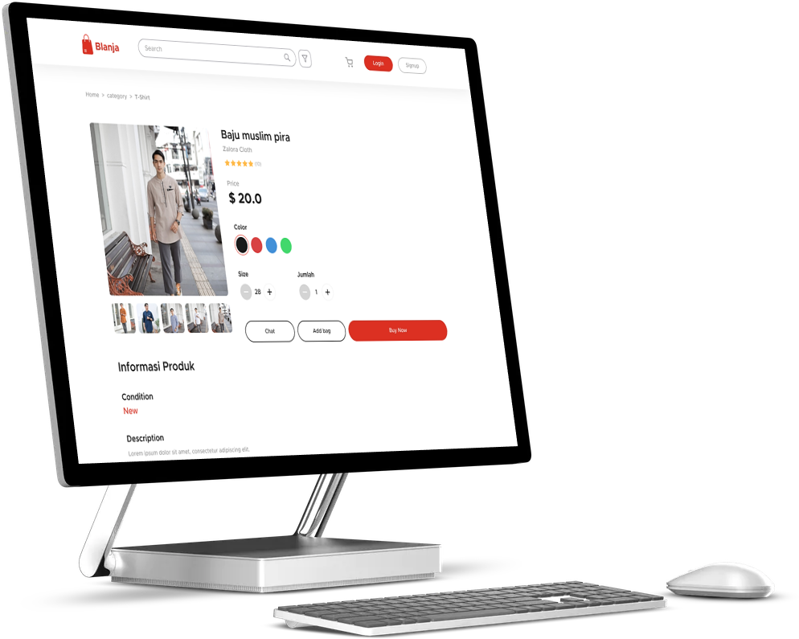

# frontend-tokofuku



## Table of Contents

- [About the Project](#about-the-project)
  - [Built With](#built-with)
- [Getting Started](#getting-started)
  - [Prerequisites](#prerequisites)
  - [Installation](#installation)
- [Roadmap](#roadmap)
- [Contributing](#contributing)
- [Acknowledgements](#acknowledgements)

<!-- ABOUT THE PROJECT -->

## About The Project

tokofuku is an online shop website that is made specifically for e-commerce purposes, for many features to support transactions in online stores
[Demo Click Here](https://tokofuku.fwdev.online)

Here's why:

- Great responsive display for any device
- Does not reload pages when moving between pages
- made with all the latest and most up-to-date tools and technology today
- two role in login (custumer & seller)
- great performance
- specially designed for online shop needs
- reusable components

Of course, no one template will serve all projects since your needs may be different. So I'll be adding more in the near future. You may also suggest changes by forking this repo and creating a pull request or opening an issue.

### Built With

- [Bootstrap-vue](https://bootstrap-vue.org/)
- [Vue.js](https://docs.vuejs.id/)
- [Node.js](https://nodejs.org/en/)

<!-- GETTING STARTED -->

## Getting Started

This is an example of how you may give instructions on setting up your project locally.
To get a local copy up and running follow these simple example steps.

### Prerequisites

This is an example of how to list things you need to use the software and how to install them.

- npm

```sh
npm install npm@latest -g
```

### Installation

1. Get a free API Key at [https://github.com/deni-irawan40563/rest-api-coffee.git](https://github.com/deni-irawan40563/rest-api-coffee.git)
2. Clone the repo

```sh
git clone https://github.com/joonacode/frontend-tokofuku.git
```

3. Install NPM packages

```sh
npm install
```

4. Enter your API in `config.js`

```JS
const API_KEY = 'ENTER YOUR API';
```

<!-- ROADMAP -->

## Roadmap

See the [open issues](https://github.com/joonacode/frontend-tokofuku/issues) for a list of proposed features (and known issues).

<!-- CONTRIBUTING -->

## Contributing

Contributions are what make the open source community such an amazing place to be learn, inspire, and create. Any contributions you make are **greatly appreciated**.

1. Fork the Project
2. Create your Feature Branch (`git checkout -b feature/AmazingFeature`)
3. Commit your Changes (`git commit -m 'Add some AmazingFeature'`)
4. Push to the Branch (`git push origin feature/AmazingFeature`)
5. Open a Pull Request

<!-- ACKNOWLEDGEMENTS -->

## Acknowledgements

- [Axios](https://www.npmjs.com/package/axios)
- [Vuex](https://vuex.vuejs.org/)
- [Vue-Router](https://router.vuejs.org/)
- [Core-js](https://www.npmjs.com/package/core-js)
- [vue-currency-filter](https://www.npmjs.com/package/vue-currency-filter)
- [vue-multiselect](https://www.npmjs.com/package/vue-multiselect)
- [vue-owl-carousel](https://www.npmjs.com/package/xx-vue-owl-carousel)
- [vue-sweetalert](https://www.npmjs.com/search?q=vue-sweetalert)
- [vue-toast-notification](https://www.npmjs.com/package/vue-toast-notification)
- [vue2-editor](https://www.npmjs.com/package/vue2-editor)

## Project setup

```
npm install
```

### Compiles and hot-reloads for development

```
npm run serve
```

### Compiles and minifies for production

```
npm run build
```

### Run your unit tests

```
npm run test:unit
```

### Lints and fixes files

```
npm run lint
```

### Customize configuration

[Registering Components Globally in Vue Reference](https://dev.to/aligoren/registering-components-globally-p8m).

[Concept Atomic Design](https://bradfrost.com/blog/post/atomic-web-design/).

See [Configuration Reference](https://cli.vuejs.org/config/).
